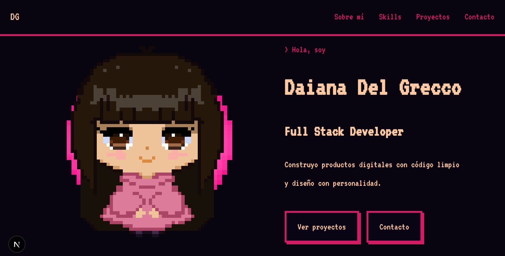

# 👾 Daiana Del Grecco | Portfolio Pixel Art

Un portfolio Full Stack con estética retro de 8-bits, construido para demostrar habilidades en desarrollo web moderno, automatización y diseño de interfaces.

## 🚀 Stack Tecnológico

- **Framework:** [Next.js 15](https://nextjs.org/) (App Router)
- **Lenguaje:** [TypeScript](https://www.typescriptlang.org/)
- **Base de Datos:** [Supabase](https://supabase.com/) (PostgreSQL)
- **Estilos:** CSS Modules & Custom VT323 Typography
- **Rendimiento:** Optimizado con Next/Image (LCP Priority)

## 🛠️ Arquitectura y Componentes Clave

### 💎 Sistema de Iconos Modular (TechIcon)
Se implementó un componente centralizado para la gestión de tecnologías. Mediante una librería de constantes, el componente adapta su escala y comportamiento (Tooltips) dependiendo de si se renderiza en la sección de **Skills** o en las **Cards de Proyectos**, reduciendo la duplicidad de estilos en un 60%.

### 🖼️ Image Lightbox Dinámico
Componente a medida para la visualización de proyectos que incluye:
- Efecto de zoom y overlay optimizado.
- Manejo de estados para accesibilidad (Escape key / Scroll lock).
- Carga prioritaria para imágenes *above-the-fold*.

### 📊 Contador de Visitas Persistente
Integración con Supabase mediante funciones de base de datos (RPC) para el seguimiento de tráfico en tiempo real, manteniendo la estética de los contadores de la "vieja escuela" de la web.

### 🎨 Pixel-Perfect UI
- Cursores personalizados (flecha y mano pixelada).
- Animaciones CSS basadas en *steps* para sprites de personajes.
- Layout totalmente responsivo utilizando CSS Grid y Flexbox.

## 📁 Estructura del Proyecto

```text
src/
├── app/             # Rutas y Server Components (Next.js 15)
├── components/      # UI Components reutilizables (TechIcon, Lightbox, etc)
├── lib/             # Clientes de API y utilidades (Supabase, Icon mappings)
└── public/          # Activos estáticos, cursores y SVGs